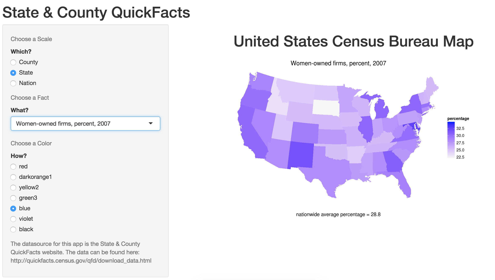
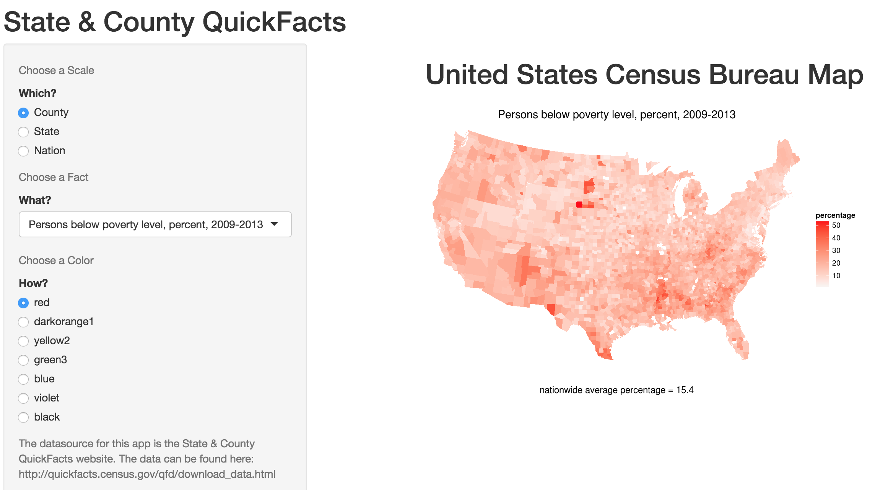

Shiny Happy People
========================================================
author: bartold
date: September 2015


We want to look up Facts about People
========================================================

The US Census Bureau has lots of [Statistics](http://quickfacts.census.gov/qfd/download_data.html) about People, and we want to look at them.

To Quote from the site: 

"The entire State and County QuickFacts dataset, with U.S., state, and county data is available for download."

But also:

"3195 rows, one for the U.S., one for each state, one for each county, but no column headings. Each row is identified by a 5-digit combined state and county code. Data are comma-delimited. ... Flat ASCII files have mnemonic identifier, full title, number of decimals, and the U.S. total value "

What?

Statistics should be Fun
========================================================

These statistics are neither easy nor fun to look at.


```
'data.frame':	3195 obs. of  5 variables:
 $ fips     : int  0 1000 1001 1003 1005 1007 1009 1011 1013 1015 ...
 $ PST045214: int  318857056 4849377 55395 200111 26887 22506 57719 10764 20296 115916 ...
 $ PST040210: int  308758105 4780127 54571 182265 27457 22919 57322 10915 20946 118586 ...
 $ PST120214: num  3.3 1.4 1.5 9.8 -2.1 -1.8 0.7 -1.4 -3.1 -2.3 ...
 $ POP010210: int  308745538 4779736 54571 182265 27457 22915 57322 10914 20947 118572 ...
```

Introducing a Shiny alternative!
========================================================

The [Shiny](http://bartold.shinyapps.io/DevelopingDataProducts/) app takes input from the user for:

- Which scale of map to show. County, State or Nation
- What statistic to look at. Lots of facts about [People](http://bartold.shinyapps.io/DevelopingDataProducts/)
- How the map should be colored. That's [Happy](http://bartold.shinyapps.io/DevelopingDataProducts/)

The app selects the info about the chosen fact from the pre-loaded dataset, and displays it on a colorful map of the US.
***





Try the Shiny Happy People app today!
========================================================

Explore the interface, and have fun! 

Head on over to the [Shiny Happy People app] (http://bartold.shinyapps.io/DevelopingDataProducts/)

Don't forget to smile when you're exploring it. It will only take a short time, and it will make me happy that you played with it.

The complete code for this presentation, and the app itself, is at [GitHub](http://github.com/tbartold/DevelopingDataProducts)
